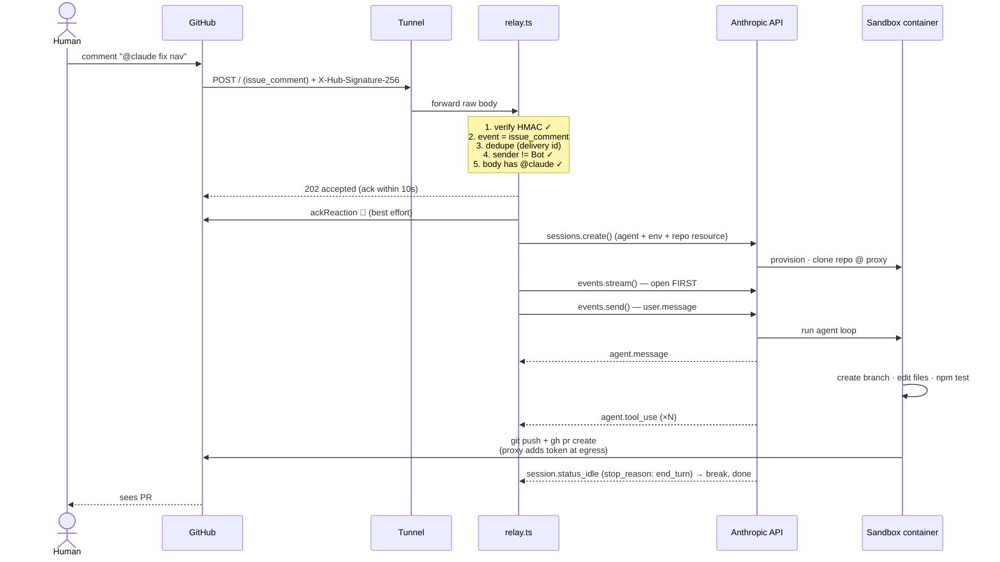
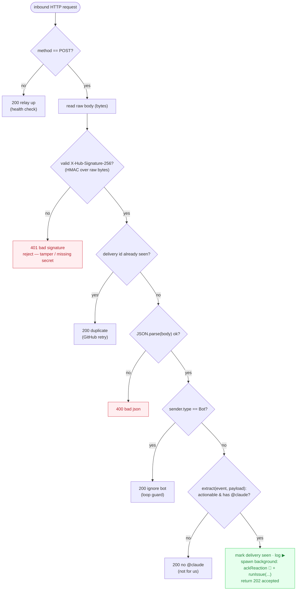
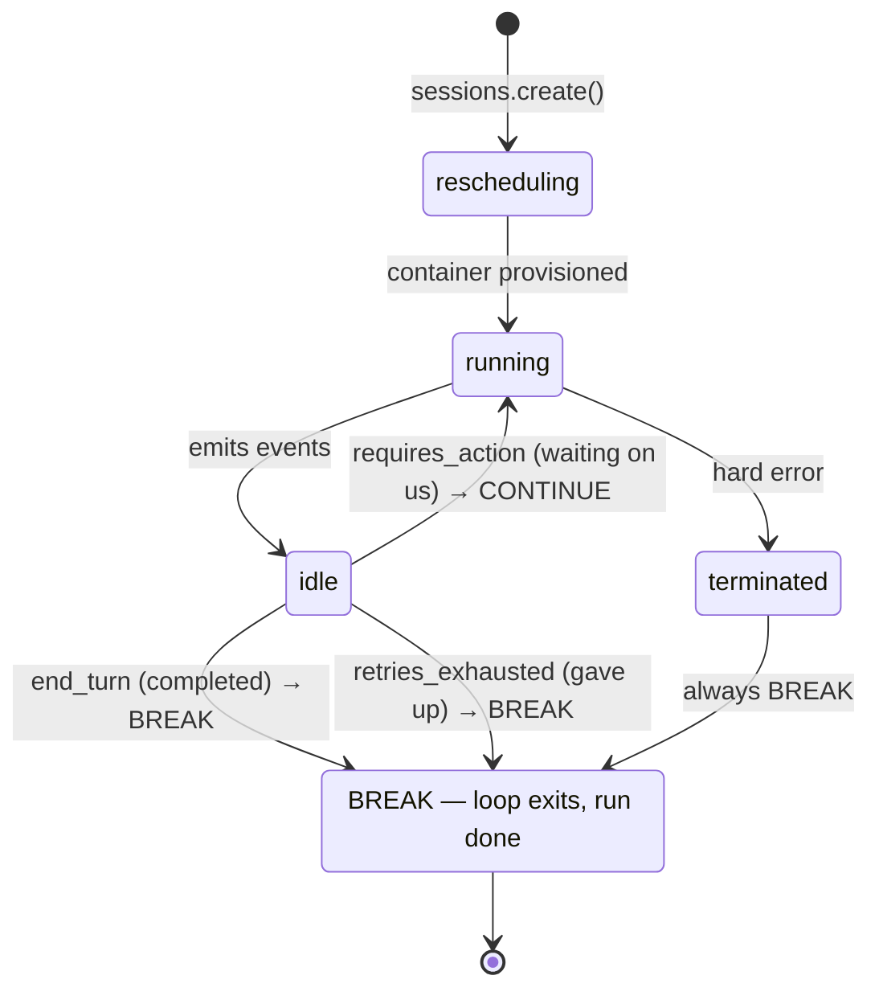

# Architecture — Local `@claude` → Claude Managed Agents

Deep reference for the local webhook relay that drives Claude Managed Agents to
fix GitHub issues, replacing the `@claude` GitHub Actions runner.

> Quickstart / setup lives in [README.md](./README.md). This doc is the *why* and
> the *how it fits together*.

---

## 0. TL;DR

```
@claude comment ─tunnel─► relay.ts (your machine) ─sessions.create()─► Managed Agent (Anthropic cloud) ─git proxy─► PR
```

- **Anthropic has no inbound webhook for GitHub.** The relay is "ordinary
  application code on your side" — it verifies GitHub's own HMAC and calls the SDK.
- **The agent loop runs in Anthropic's cloud, never locally.** Only the *trigger*
  is local. Tools (bash/edit/git) run in an Anthropic-hosted per-session container.
- **The repo token never enters the prompt.** It's attached as a
  `github_repository` resource; a sandbox git proxy injects it at egress.

---

## 1. The three zones

Everything below sorts into one of three trust/runtime zones. Knowing which zone
a thing lives in tells you who runs it and what secrets it can see.

```
┌─────────────────────────┐   ┌──────────────────────────────────┐   ┌──────────────────────────────┐
│         GITHUB          │   │      YOUR MACHINE (local)        │   │       ANTHROPIC CLOUD        │
│      (github.com)       │   │                                  │   │                              │
│                         │   │   ┌──────────┐    ┌───────────┐  │   │   ┌──────────────────────┐   │
│  repo, issues, PRs      │   │   │  tunnel  │    │ relay.ts  │  │   │   │   agent loop (Claude) │   │
│  webhook delivery ──────┼───┼──►│ ngrok /  │───►│ Bun.serve │  │   │   │   claude-haiku-4-5    │   │
│                         │   │   │cloudflared│   │  :8788    │  │   │   └──────────┬───────────┘   │
│  ▲                      │   │   └──────────┘    └─────┬─────┘  │   │              │ tools          │
│  │ git push + gh        │   │                         │        │   │   ┌──────────▼───────────┐   │
│  │ (via git proxy)      │   │           sessions.create()──────┼───┼──►│  per-session container│   │
│  │                      │   │                         │        │   │   │  /workspace/repo      │   │
│  └──────────────────────┼───┼─────────────────────────┼────────┼───┼───┤  bash · edit · git    │   │
│                         │   │                         │        │   │   └──────────────────────┘   │
└─────────────────────────┘   └──────────────────────────────────┘   └──────────────────────────────┘
        GitHub's HMAC                  ANTHROPIC_API_KEY                  runs the model + sandbox
        signs deliveries               GITHUB_WEBHOOK_SECRET
                                       GITHUB_TOKEN (repo PAT)
```

| Zone | Runs | Holds secrets | Notes |
|------|------|---------------|-------|
| **GitHub** | webhook delivery, hosts repo | repo webhook secret | Signs every delivery with `X-Hub-Signature-256`. |
| **Your machine** | `relay.ts` + a tunnel | `ANTHROPIC_API_KEY`, `GITHUB_WEBHOOK_SECRET`, `GITHUB_TOKEN` | The only code *you* run. Stateless except an in-memory dedupe set. |
| **Anthropic cloud** | agent loop + tool sandbox | the repo PAT (passed per-session, injected by git proxy) | You don't manage containers; Anthropic does. |

---

## 2. Request lifecycle (happy path)

End-to-end sequence from a human typing `@claude` to a PR appearing. Time flows
downward. `═══` = network hop.



**Key ordering rule:** `events.stream()` is opened *before* `events.send()`
(stream-first). SSE has no replay — open after send and you miss the agent's first
events.

---

## 3. Relay decision flow

Exactly what `relay.ts`'s `fetch` handler does with each inbound request. Every
leaf is a real HTTP status the relay returns.



`extract()` recognises exactly three events (action-gated):

| `X-GitHub-Event` | action | yields |
|---|---|---|
| `issue_comment` | `created` | `{ number: issue.number, body: comment.body, title: issue.title }` |
| `pull_request_review_comment` | `created` | `{ number: pull_request.number, body: comment.body, title: pull_request.title }` |
| `issues` | `opened` | `{ number: issue.number, body: issue.body, title: issue.title }` |
| anything else | — | `null` → `200 "no @claude"` |

---

## 4. Component map

```
agent-study/
│
├── relay.ts ─────────────► the trigger server (NEW glue)
│     │  imports                  • Bun.serve on 127.0.0.1:8788
│     │                           • HMAC verify · dedupe · @claude detect · bot guard
│     ▼                           • pre-warms agent at startup (no create in request path)
├── agent.ts ─────────────► shared Managed Agents driver
│     ▲   │                       • ensureAgentAndEnv()  → cached singleton + .state.json
│     │   │                       • runIssue()           → session + stream loop
│     │   ▼
│     │  .state.json ──────► { agentId, environmentId }   (gitignored, written once)
│     │
├── fix-issue.ts ─────────► manual CLI  (bun run fix-issue <n>)
│         imports agent.ts        • gh issue view → runIssue()   (same code path as relay)
│
├── .env ─────────────────► ANTHROPIC_API_KEY · GITHUB_TOKEN · GITHUB_WEBHOOK_SECRET (gitignored)
├── .env.example ─────────► template (committed)
├── README.md ────────────► quickstart / setup steps
└── ARCHITECTURE.md ──────► this file
```

Both entry points (`relay.ts`, `fix-issue.ts`) funnel through `runIssue()` in
`agent.ts` — single source of truth for how a session is created and streamed.

---

## 5. Session state machine

What `sessions.create()` spins up, and how `agent.ts`'s stream loop decides when
it's done. States come from Anthropic; the break logic is ours.



> **The trap this avoids:** `idle` is *transient*. The session goes idle between
> parallel tool runs and while awaiting your input. Breaking on `idle` alone exits
> early and orphans a still-working agent. Break only on `idle + terminal
> stop_reason`, or on `terminated`.

`agent.ts` loop, condensed:

```
for await (event of stream):
    agent.message            → print text
    agent.tool_use           → log "[tool: name]"
    session.status_terminated→ BREAK
    session.status_idle:
        requires_action      → CONTINUE   (waiting on us; not used here yet)
        else (end_turn/…)    → BREAK
```

---

## 6. Security model

Two independent secret boundaries. Neither secret crosses into the agent's prompt.

```
   GitHub ──► relay                         relay ──► Anthropic ──► sandbox ──► GitHub
   ════════════════════                     ═══════════════════════════════════════════
   X-Hub-Signature-256                       repo PAT travels as a
   = HMAC_SHA256(secret, RAW BODY)           github_repository RESOURCE
                                             (authorization_token field)
   relay recomputes & compares                       │
   (timing-safe, length-checked)                     ▼
        │                                     sandbox git proxy holds it
        ├─ match    → process                 and injects on `git push` / `gh`
        └─ mismatch → 401, drop                       │
                                                      ▼
   ⚠ verify BEFORE JSON.parse —               token NEVER appears in:
     a tampered body changes the                • the prompt / user.message
     bytes the MAC was computed over              • the SSE event history
     so verification fails first                  • events.list() / compaction
```

Layered guards:

- **HMAC verify-then-parse** — tampered or unsigned bodies are rejected before any
  parsing. (Smoke-tested: tampered body → `401`.)
- **Bot loop guard** — `sender.type == "Bot"` events are ignored, so the agent's own
  activity can't re-trigger a run. The ack is a 👀 *reaction* (not a comment) and
  carries no `@claude`, so it can't loop either.
- **Dedupe** — GitHub redelivers on non-2xx; the in-memory delivery-id set drops
  repeats. (In-memory only — a relay restart forgets ids.)
- **Least-privilege token** — use a *fine-grained* PAT scoped to this repo
  (Contents/PR/Issues RW), not your broad `gh auth token`.

---

## 7. Old vs new — what moved where

```
        BEFORE  (.github/workflows/claude.yml)          AFTER  (agent-study/relay.ts)
   ═══════════════════════════════════════════     ═══════════════════════════════════════════
   @claude ─► GitHub Actions runner (ubuntu)        @claude ─► tunnel ─► relay.ts (your machine)
                │                                                          │
                │ claude-code-action@v1                                    │ sessions.create()
                ▼                                                          ▼
        agent runs ON the runner                            agent runs IN Anthropic cloud
                │                                                          │
        3× retry + build/test gate   ◄── workflow logic     (agent advised to test; hard gate
                │                         (enforced)          is ci.yml on the resulting PR)
                ▼                                                          ▼
        gh pr create + synthetic status                     agent opens PR via git proxy
                                                                           │
        ci.yml: required "build-test" check ◄─────────────────────────────┘ (KEEP — still runs)
```

| Concern | GitHub Actions (`claude.yml`) | Relay (`relay.ts`) |
|---|---|---|
| Where the agent runs | GitHub-hosted runner | Anthropic cloud |
| Trigger transport | native Actions event | GitHub webhook → tunnel → relay |
| Infra you run | none (GitHub's) | one Bun process + a tunnel |
| Enforced retry/test gate | yes (3× in workflow) | no — relies on `ci.yml` on the PR |
| Session persistence | none (ephemeral run) | Anthropic-managed session + history |
| Status: **disable** | ← this one, at cutover | — |
| Status: **keep** | `ci.yml`, `gemini.yml`, `gemini-triage.yml` | — |

**Cutover is last** (README §6): only after a successful relay test, restrict
`claude.yml`'s triggers (e.g. `on: workflow_dispatch`) so `@claude` doesn't fire
twice. **Keep `ci.yml`** — it's still the required build/test check on the PR the
agent opens.

---

## 8. Known limits (study scope)

- **No enforced test/retry loop.** The agent is *told* to run `npm test`; the hard
  gate is `ci.yml` on the PR, not the relay. Rebuild the 3× loop in the relay if you
  need it enforced *before* the PR opens.
- **Dedupe is in-memory.** A relay restart forgets delivery ids; a GitHub redelivery
  after restart could double-fire. Persist the set (file/redis) for production.
- **One session per `@claude`.** No per-issue concurrency cancel (the Actions flow
  had `cancel-in-progress`). Two `@claude` comments = two sessions.
- **Tunnel is a single point of presence.** ngrok free URLs rotate per run; update
  the GitHub webhook URL or use a named cloudflared tunnel for stability.
- **The model loop is never local.** "Self-hosted" in Managed Agents moves only
  *tool execution* to your infra — Claude's reasoning always runs at Anthropic.

---

## 9. Glossary

| Term | Meaning here |
|---|---|
| **Agent** | Persisted, versioned config (model + system + tools). Created once; `.state.json` caches its id. |
| **Environment** | Container template (`cloud` + `unrestricted` networking). Created once; cached. |
| **Session** | One run pairing the agent + environment, with the repo mounted. Created per `@claude`. |
| **`github_repository` resource** | Repo mounted at `/workspace/repo`; git proxy injects the PAT at egress. |
| **git proxy** | Sandbox-side egress that adds the token to git/gh calls so it stays out of the prompt. |
| **stop_reason** | On `session.status_idle`: `requires_action` (continue) vs `end_turn` / `retries_exhausted` (terminal). |
| **delivery id** | GitHub's `X-GitHub-Delivery` header; the dedupe key. |
```
