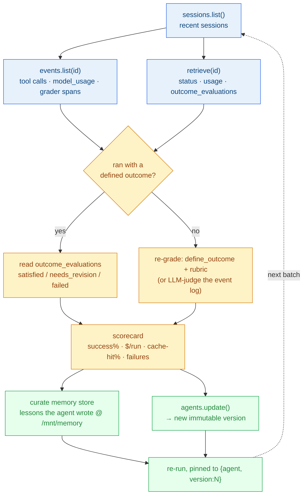

# Enterprise Playbook — spinning up tasks well & running Managed Agents smoothly

How the case-study companies (Sentry, Notion, Rakuten, Vibecode) run Claude
Managed Agents in production, distilled from the Managed Agents docs and mapped to
the scars from building the [`@claude` relay](./README.md) in this repo.

Each pattern below was extracted from the docs and independently fact-checked.

## The one principle

> Treat Managed Agents as **a fleet of disposable *runs* over a few durable,
> versioned *configs*** — and drive each run as **a state machine you observe**,
> not a fire-and-forget call.

Everything else is a corollary of those two ideas.

---

## Part 1 — Spin up the task well (create-side)

| Rule | Why | Seen in |
|------|-----|---------|
| **Create config once, run per task** | Agent + environment (+ vault + memory store) are durable, versioned templates made in setup and cached by id; the **session** is the disposable per-task unit. `agents.create()` in the request path is the named anti-pattern (orphan objects + create latency). Pin `{type:"agent", id, version:N}` for reproducible runs; the bare-string ref floats to *latest*. | All four; Vibecode runs millions of sessions over a few agent configs. |
| **Kick off stream-first, with the right event** | SSE has **no replay** — open `GET /v1/sessions/{id}/events/stream` *before* `events.send()`, or early events arrive batched and you lose real-time reaction. Pick the kickoff: `user.message` (open work) vs `user.define_outcome` (rubric-graded iterate-to-green). No need to wait on status; multiple instructions queue in order. Never put secrets in the kickoff text — it's stored in event history. | Rakuten batches Slack/Teams instructions into one ordered turn. |
| **Credentials in vaults, never in the prompt** | Tools/MCP are declared on the **agent** (no auth field); secrets live in **vaults** attached at session-create (`vault_ids` is create-only). A proxy injects them *at egress*, so they never enter the sandbox or history — survives prompt injection. Gate dangerous tools with `permission_policy:{type:"always_ask"}`. | Rakuten's isolated sandboxes for non-engineers; our git-proxy token isolation. |
| **Pin the environment + blast radius** | cloud vs `self_hosted` chosen at env-create. Networking **deny-by-default** (`{type:"limited", allowed_hosts:[…]}`); open `allow_mcp_servers`/hosts explicitly or MCP calls silently fail. Mount repos/files as `resources` with **absolute** `mount_path`. | Sentry runs self-hosted via Vertex AI for **data residency**. |

---

## Part 2 — Keep it running smoothly (operate-side)

1. **Terminate correctly — the #1 reliability rule.** Break only on `session.status_idle` **+ a terminal `stop_reason`**; idle is *transient* (parallel tools, awaiting `tool_confirmation`/`custom_tool_result`). Distinguish `session.status_rescheduled` (retryable — keep going) from `session.status_terminated` (dead — stop).
2. **Lossless reconnect + idempotency.** SSE has no replay → on reconnect, open the stream, *then* drain `events.list()`, dedupe by `event.id` — and don't let the dedupe `continue` skip the terminal event. The same `Set<event.id>` absorbs redeliveries.
3. **Observe, don't fire-and-forget.** `span.model_request_start/end` → latency; `model_usage.cache_read_input_tokens` → confirms prompt caching is paying off (the 90%-cost / 85%-latency lever); `processed_at` → queued vs processed; `agent.thread_context_compacted` → long-session warning. Thin HMAC **webhooks** for state pings when you don't hold the stream.
4. **Gate quality autonomously with Outcomes.** `user.define_outcome` + a **reusable rubric file** → the agent self-iterates until `satisfied`. Gate your loop on **session idle**, not the grader event (`needs_revision` keeps the session running). This is how you ship *merge-ready* output unattended.
5. **Govern concurrency.** Multiagent coordinator: **≤20 unique roster, ≤25 concurrent threads, depth = 1** (no orchestrator trees) — or shard across sessions. `session.status` aggregates thread health. Archive sessions when done to free resources.
6. **Autonomy + safety valves.** **Deployments** for cron (verify `schedule.upcoming_runs_at`, pin IANA `timezone`, avoid the 1–3 AM DST window, alert on `deployment_runs` where `has_error=true`). **`pause` is the reversible kill-switch; `archive` is permanent** for agents/environments/memory-stores — only **sessions** are safely disposable.
7. **Isolate by store id; wall off by workspace.** Agents/envs/memory-stores are **workspace-scoped**, and the **API key picks the workspace implicitly** — so everything you've created lives in one (likely `Default`). Within a workspace, per-project isolation is just **one `memory_store` id per project**: attach the *same* id to share lessons across runs/deployments, a *new* id to separate — nothing auto-detects "same project," you pin the pointer (cached in `.state.json`). **Split into a new workspace only when a project needs its own credentials/vaults, separate billing or rate limits, or a hard blast-radius wall** — i.e. the day one agent must touch secrets another project's agent must never see. Solo + one repo = one workspace + one store id: correct, don't over-split. Cross-workspace references are rejected outright (the hard boundary); cross-project bleed *within* a workspace only happens if you hand the same store id to unrelated work.

---

## The eval loop: retrieve → eval → improve

The canonical way to read sessions, grade them, and make the agent better over
time — three first-party mechanisms wired into one cycle. (Built on the Sessions
API behind `platform.claude.com/workspaces/default/sessions`.)

**1 · Retrieve** — `sessions.list()` enumerates runs; per run, `events.list(id)` is
the source of truth (every `agent.tool_use`/`tool_result`, `span.model_request_end.model_usage`
for cost + cache-hit %, and any `span.outcome_evaluation_end`), while `retrieve(id)`
is the quick header (`status`, `usage`, `outcome_evaluations`). Same data the
dashboard renders.

**2 · Eval** — if the session was kicked off with a `user.define_outcome`, the grade
already exists: read `outcome_evaluations` (`satisfied` / `needs_revision` / `failed`).
If not (e.g. our `@claude` fix sessions), **re-grade** — spin a fresh outcome session
with a rubric pointed at the prior output in `/mnt/session/outputs/`, or run an
LLM-judge over the event log. Either way, roll the results into a **scorecard**:
success rate, $/run (from `model_usage`), cache-hit %, and top failure reasons
(`terminated` vs `idle` `stop_reason`).

**3 · Improve** — two durable levers. The agent writes lessons to its **memory store**
during runs (`/mnt/memory/<store>/`, each write an immutable `memver` tagged with its
`session_id`); you curate them host-side via `memory_stores.memories.list/update`.
When the scorecard exposes a systemic prompt/tool gap, `agents.update()` mints a
**new immutable agent version**.

**Loop** — re-run the next batch **pinned to `{agent, version:N}`** so you can A/B the
improvement against the prior version, then retrieve those sessions and repeat. That
closed loop is what turns the dashboard's raw numbers into an agent that gets better.

> **For this repo's relay specifically:** its sessions currently run *without* an
> outcome, so they land on the **"no"** branch (re-grade or judge). The upgrade that
> makes the relay self-grading like Sentry's is to send a `user.define_outcome` at
> kickoff with a rubric like *"a PR is opened, `npm test` is green, the diff is
> minimal and scoped to the issue."*

## How each customer leans on it

| Customer | Signature patterns |
|----------|--------------------|
| **Sentry** (Seer) | self-hosted/Vertex (residency) + **Outcomes** (merge-ready PRs) + agent-once across ~600k PRs/mo. |
| **Notion** | **multiagent** fan-out (30+) + **memory** (agents improve) + caching (90% / 85%). |
| **Rakuten** | **vaults + permission policies + isolated sandboxes** (safe for non-engineers), many triggers (Slack/Teams). |
| **Vibecode** | **multi-tenant**: vault + session per end-user, aggressive session archive, one agent config over millions of runs. |

---

## What this repo's relay already implements

Building the small `@claude` relay independently landed ~7 of these before we read
the enterprise docs:

- agent-created-once + cached id (`agent.ts` `.state.json`)
- pre-warm at startup → fail fast on a bad key
- stream-first kickoff
- the idle-break gate (terminal `stop_reason` only)
- git-proxy token isolation (token never in prompt/history)
- host-side PR creation (the sandbox is git-only)
- fast-ack (<10s) + background dispatch + delivery-id dedupe

The enterprises stack **vaults, outcomes, multiagent, scheduled deployments,
memory, and self-hosting** on top of exactly this spine. See [EVAL.md](./EVAL.md)
for the runner-vs-Managed-Agents comparison and why the trade flips with scale.
