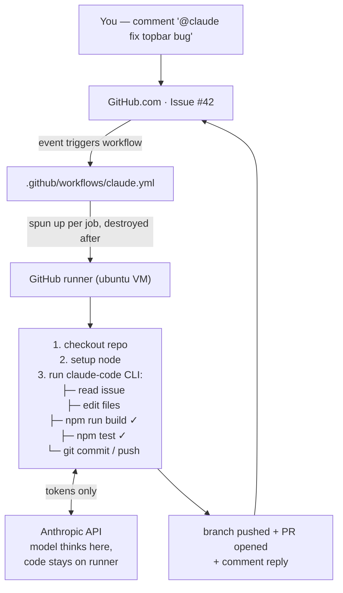
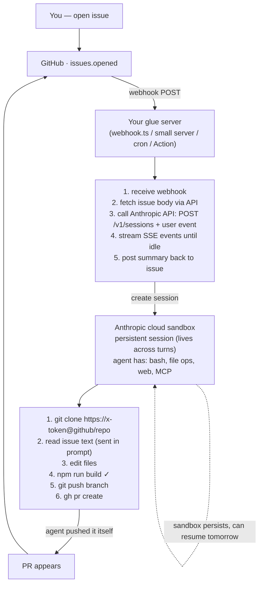
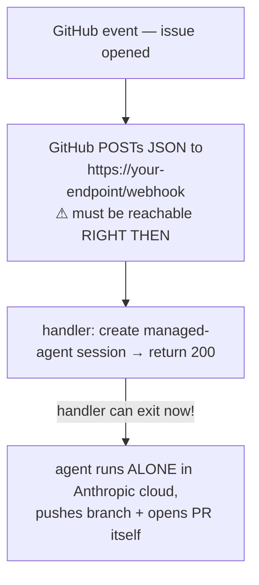

# Study: Claude Agents for GitHub Issue → Fix → PR

Two ways to let Claude automatically pick up GitHub issues, fix code, verify builds, and open PRs.

- **Method 1 — GitHub Runner** (`claude-code-action`): purpose-built, one YAML file. ← start here
- **Method 2 — Managed Agents API**: raw agent harness in Anthropic's cloud, you build the glue.

---

## Method 1: GitHub Runner (claude-code-action)

Docs: <https://code.claude.com/docs/en/github-actions>
Action repo: <https://github.com/anthropics/claude-code-action>

### Flow



### Key facts

- Runs full Claude Code CLI inside a GitHub Actions runner; repo is checked out there.
- Trigger built in: `@claude` mention in issue/PR comments, or any GitHub event with a `prompt`.
- Bash is **allowlisted**, not open: `claude_args: --allowedTools "Bash(npm run build),..."` — exact command or `prefix:*` wildcard.
- "Build before push" is a *contract*, not a guarantee: put it in `CLAUDE.md` ("Always run `npm run build` and tests before pushing"). Normal CI on the PR is the second gate.
- The action **cannot create PRs at all** (documented limitation, not model behavior): from an issue it pushes a branch + posts a prefilled "create PR" link, full stop. Allowing `Bash(gh pr create:*)` does not change this. True auto-PR = a separate workflow step after the action, using its `branch_name` + `github_token` outputs to run `gh pr create` deterministically (implemented in `claude.yml` 2026-06-12).
- Commits pushed by the default Actions token do NOT trigger other workflows; the Claude GitHub app token avoids this, so CI still runs on Claude's PRs.

### Setup (this repo)

1. Install GitHub app: run `/install-github-app` inside `claude` (terminal), or manually install <https://github.com/apps/claude> on the repo.
2. Add secret (repo Settings → Secrets and variables → Actions):
   - `ANTHROPIC_API_KEY` (pay-per-token), **or**
   - `CLAUDE_CODE_OAUTH_TOKEN` (from `claude setup-token`, uses Pro/Max subscription — no API bill).
3. Workflow file: `.github/workflows/claude.yml` (already in this repo).
4. Test: open an issue, comment `@claude fix ...`.

### Cost

- Runner minutes: this repo is **private** → GitHub Free = 2,000 min/month, Pro = 3,000 (Linux 1×). Typical job 5–15 min. Public repos: unlimited free.
- Claude tokens: usually the bigger cost — $0.10–$1+ per fix via API key; or covered by Pro/Max subscription via OAuth token.
- Self-hosted runner option: install runner agent on own machine, `runs-on: self-hosted`, minutes never billed.

---

## Method 2: Managed Agents API

Docs: <https://platform.claude.com/docs/en/managed-agents/overview>

### Flow



### Key facts

- Four concepts: **Agent** (model + system prompt + tools) → **Environment** (cloud or self-hosted sandbox) → **Session** (running instance, stateful) → **Events** (messages/SSE stream).
- Beta: all requests need `managed-agents-2026-04-01` header (SDK sets it automatically).
- No built-in GitHub trigger — you wire webhook (`issues.opened`) → your server → create session → prompt agent with issue body + a repo token → stream until `session.status_idle`.
- Sandbox has bash + unrestricted network option → agent can `git clone`, run builds, `gh pr create` itself.
- Stateful: persistent filesystem + history, resumable across days. Not ZDR/HIPAA-eligible because of this.
- Minimal session bootstrap (TypeScript):

```ts
const agent = await client.beta.agents.create({
  name: "Issue Fixer",
  model: "claude-opus-4-8",
  system: "Fix the GitHub issue described. Run npm run build and tests before pushing.",
  tools: [{ type: "agent_toolset_20260401" }],
});
const env = await client.beta.environments.create({
  name: "fixer-env",
  config: { type: "cloud", networking: { type: "unrestricted" } },
});
const session = await client.beta.sessions.create({
  agent: agent.id, environment_id: env.id, title: "Fix issue #42",
});
// then send a user.message event with issue body + repo token, stream SSE until idle
```

### Cost

- Claude API tokens only (no subscription option); sandbox compute included. No GitHub runner minutes.

### How the webhook trigger works (findings)

GitHub webhooks **push** events to your URL — something must be reachable at the moment the event fires. But the handler only needs to live **seconds**: create session → send issue text → return 200. No need to hold the SSE stream open; the agent finishes alone in Anthropic's sandbox and opens the PR itself. Fire-and-forget.



Four ways to "be listening":

| # | Option | How | Verdict |
|---|--------|-----|---------|
| 1 | Always-on server | VPS / machine 24-7, public IP | heavy, skip |
| 2 | **Serverless function** | `api/github-webhook.ts` on Vercel — platform listens for you, zero idle cost | **best real option** (already deploy there) |
| 3 | Local + tunnel | smee.io / ngrok → local bun server | dev/study day only |
| 4a | Polling (no webhook) | cron every 5 min: `gh issue list --label agent-fix` → create sessions | no public URL ever |
| 4b | GitHub Actions as webhook | workflow `on: issues` just curls managed-agents API — GitHub hosts the listener free | full circle: Method 1 trigger + Method 2 brain |

Option 4b: runner runs ~30s (create session, exit); agent works for hours after in the sandbox.

Note: `webhook.ts` at repo root is unrelated — it pipes localhost events into a local Claude Code session (MCP channel), not GitHub glue.

---

## Comparison

```
                      RUNNER METHOD              MANAGED AGENT METHOD
                 ┌──────────────────────┐    ┌──────────────────────────┐
 setup effort    │ ▓░░░░  one YAML      │    │ ▓▓▓▓░  build glue server │
 trigger         │ free (@claude)       │    │ DIY (webhook/cron)       │
 repo access     │ automatic (checkout) │    │ manual (pass token)      │
 task length     │ short (job timeout)  │    │ long (hours, resumable)  │
 state           │ none, fresh each run │    │ persistent filesystem    │
 best for        │ "issue → PR"         │    │ custom agent products    │
                 └──────────────────────┘    └──────────────────────────┘
```

One sentence: runner method = GitHub brings compute + trigger + repo to Claude; managed agent = Anthropic brings compute, you deliver trigger + repo yourself.

## Study plan

- [x] Method 1: add workflow, install app, add secret, test with a real issue
  - Verified end-to-end 2026-06-11: issue #1 → Haiku fix → branch → PR #2 → CI gate (`ci.yml` + branch protection on `main`) → merge
  - Lesson: prompt is advisory (Haiku skipped build step), branch protection is the enforced gate
  - Correction 2026-06-12: "agent didn't open PR" was the action's documented limitation, not prompt-skipping — see Key facts; fixed with a post-action `gh pr create` step
- [ ] Method 2: run `agent-study/fix-issue.ts <issue#>` — CLI glue that creates a managed-agent session to fix an issue
  - Needs `ANTHROPIC_API_KEY` env + optional repo-scoped `GITHUB_TOKEN` (falls back to `gh auth token`)
  - Later: upgrade glue from CLI to auto-trigger — preferred: Vercel serverless function (option 2) or GitHub Actions-as-webhook (option 4b); see webhook findings above
