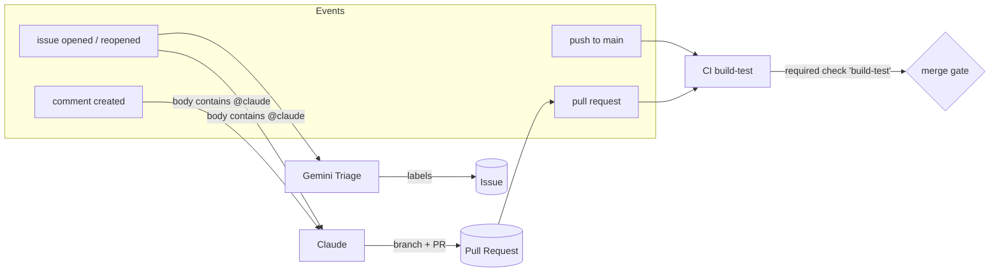
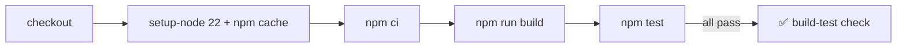
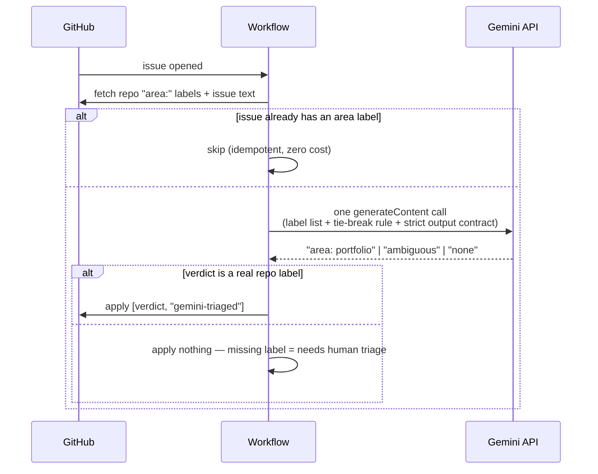
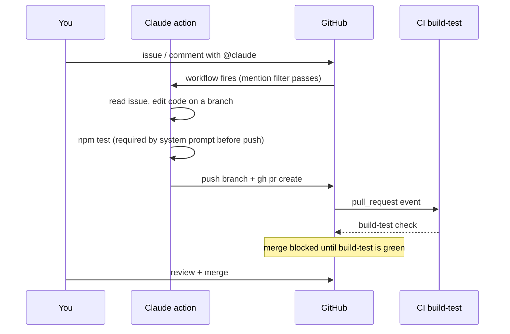
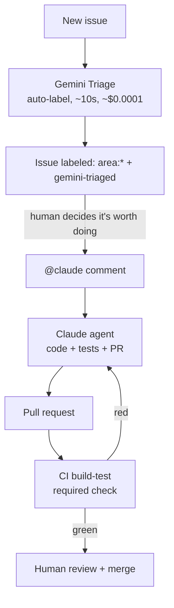

# GitHub Workflows — Design Overview

This repo runs three active workflows (plus one inactive draft). Together they form a
small automation system: **CI guards quality, Gemini sorts incoming issues, Claude does
the work on request.**

## Event routing — who fires on what

A new issue can fire **both** Gemini Triage and Claude — they are independent jobs with
separate concerns (sorting vs. solving) and never conflict: triage only writes labels,
Claude only writes code/comments.

---

## 1. `ci.yml` — quality gate

| | |
|---|---|
| Triggers | `push` to `main`, every `pull_request` |
| Permissions | `contents: read` (cannot write anything) |
| Job | `build-test`: `npm ci` → `ng build` → jest tests |
| Role | Required status check — branch protection blocks merge until green |

Design notes:
- Read-only permissions: CI can never push, label, or comment. Smallest possible blast radius.
- Runs on PRs from *any* source — including Claude's auto-generated PRs, which is what
  makes the agent loop below safe.

## 2. `gemini-triage.yml` — issue classifier (sorting, not solving)

| | |
|---|---|
| Triggers | `issues: [opened, reopened]` — automatic, no mention needed |
| Permissions | `issues: write`, `contents: read` |
| Auth | `GEMINI_API_KEY` secret → Gemini REST API (no CLI, no OAuth) |
| Script | `.github/scripts/gemini-triage.mjs` — dependency-free Node 22 |
| Pattern source | `angular/dev-infra` issue-labeling action (the `gemini-triaged` label on angular/angular issues) |

Design notes:
- **LLM as one-shot classifier, never as agent.** Single API call, closed output set,
  no tool use, no loop. Cheap (~$0.0001/issue), fast (~10s), cannot go rogue.
- **Validation chokepoint:** the model's text answer is checked against the live label
  list before any write. A hallucinated label is silently dropped, so an `area:` label
  on an issue is always either human-applied or a verified AI pick.
- **Tie-break baked into the prompt:** component-specific styling issues get the
  component label; `area: design` is reserved for global theming.
- Valid labels: `area: portfolio`, `area: about`, `area: topbar`, `area: design`,
  `area: ci`. Marker: `gemini-triaged`.

## 3. `claude.yml` — coding agent (solving, on request)

| | |
|---|---|
| Triggers | `@claude` mention in issue body, issue comment, or PR review comment |
| Permissions | `contents/issues/pull-requests: write`, `id-token: write` (OIDC) |
| Engine | `anthropics/claude-code-action@v1`, pinned to Haiku 4.5 |
| Guardrails | allowlisted Bash commands only, `--max-turns 15`, 30-min timeout |

The full agent loop, including how CI gates it:

Design notes:
- The `if:` mention filter means most issue/comment events result in a 1–2s "skipped"
  run — that is normal and free.
- The appended system prompt forces test-before-push and a real `gh pr create`, so
  every Claude change lands as a reviewable PR that CI then validates. The agent never
  merges; the human + the required check do.
- Tool allowlist limits Bash to `npm ci/build/test` and `gh pr create` — the agent can
  build and propose, not administer.

## 4. `gemini.yml` — inactive draft (do not commit as-is)

Untracked local file. References `google/antigravity-action@v1`, which **does not
exist** on the GitHub marketplace, and `ANTIGRAVITY_API_KEY`, which the Antigravity CLI
does not support yet (open feature request:
[antigravity-cli#78](https://github.com/google-antigravity/antigravity-cli/issues/78) —
`agy` is OAuth-only as of June 2026). Kept as a study note; the triage workflow above
is the working replacement for the "Gemini in CI" idea.

---

## The system in one picture

Division of labor:

| Layer | Tool | Cost per event | Trust level |
|---|---|---|---|
| Sort | Gemini flash-lite, one constrained call | ~$0.0001 | Can only apply pre-validated labels |
| Solve | Claude Haiku 4.5, agentic, max 15 turns | cents | Can edit code, but only via PR |
| Gate | Deterministic CI, no AI | runner minutes | Final authority before merge |

The trust gradient is the design: the cheaper and more constrained the layer, the more
automatically it runs. The expensive, powerful layer (Claude) only runs on explicit
human request, and its output still passes through the deterministic gate.
